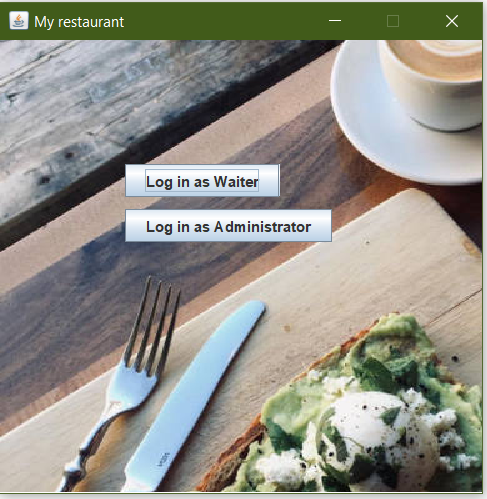
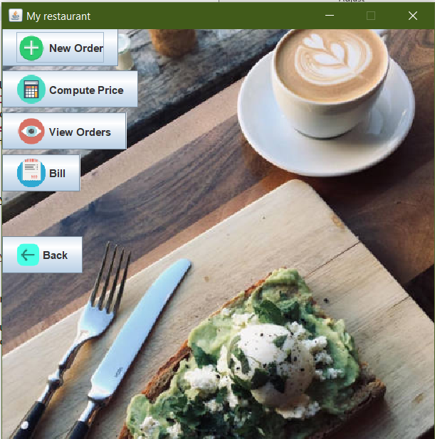
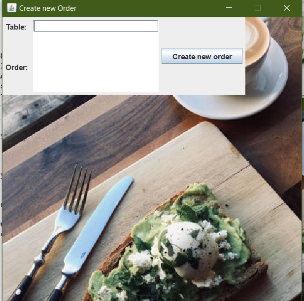
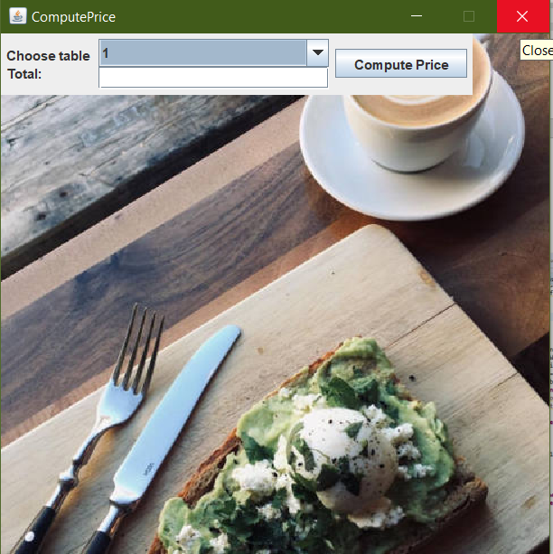
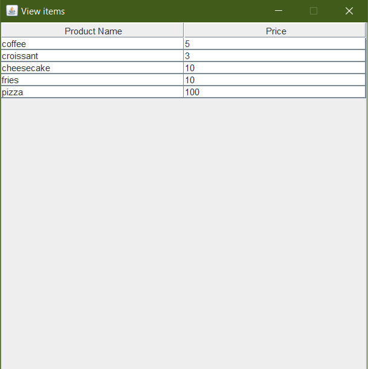
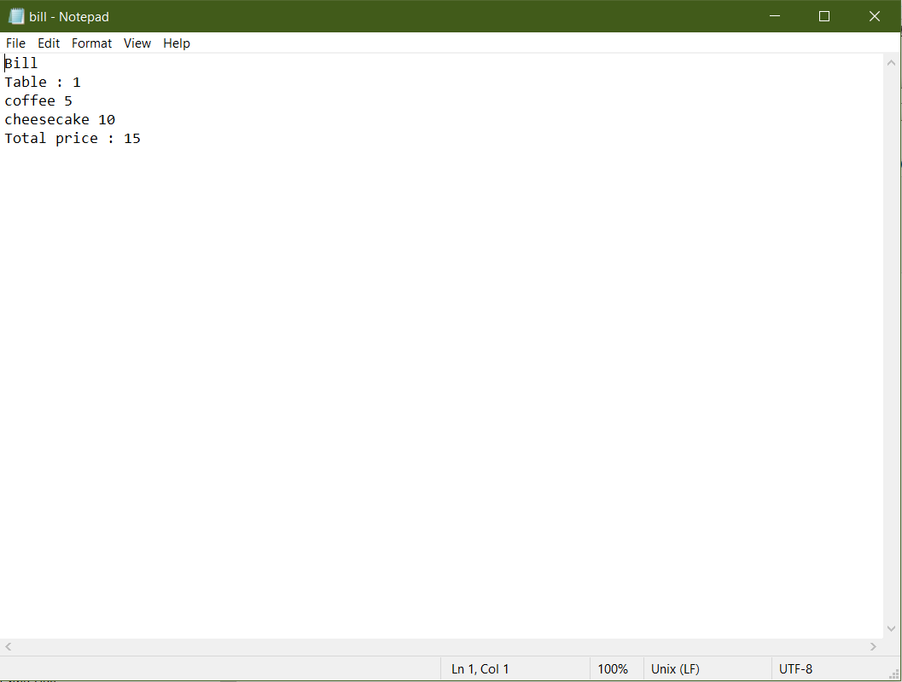

# Restaurant_Management_System
This is a restaurant management system. The system has three types of
users: administrator, waiter and chef. 
-The administrator can add, delete and modify existing
products from the menu. 
-The waiter can create a new order for a table, add elements from the
menu, and compute the bill for an order. 
-The chef is notified each time it must cook food that is
ordered through a waiter. 

1) The interface IRestaurantProcessing containing the main operations that can be
executed by the waiter/administrator, as follows:
• Administrator: create new menu item, delete menu item, edit menu item
• Waiter: create new order; compute price for an order; generate bill in .txt
format.
2) Composite Design Pattern for defining the classes MenuItem,
BaseProduct and CompositeProduct 
3) Use the Observer Design Pattern to notify the chef each time a new order
containing a composite product is added.
4) The class Restaurant is implemented using a predefined JCF collection that is based on a
hashtable data structure. 

